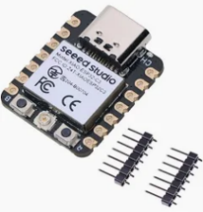
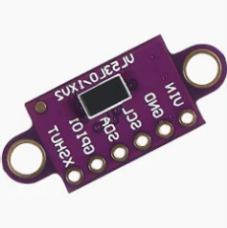
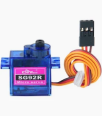
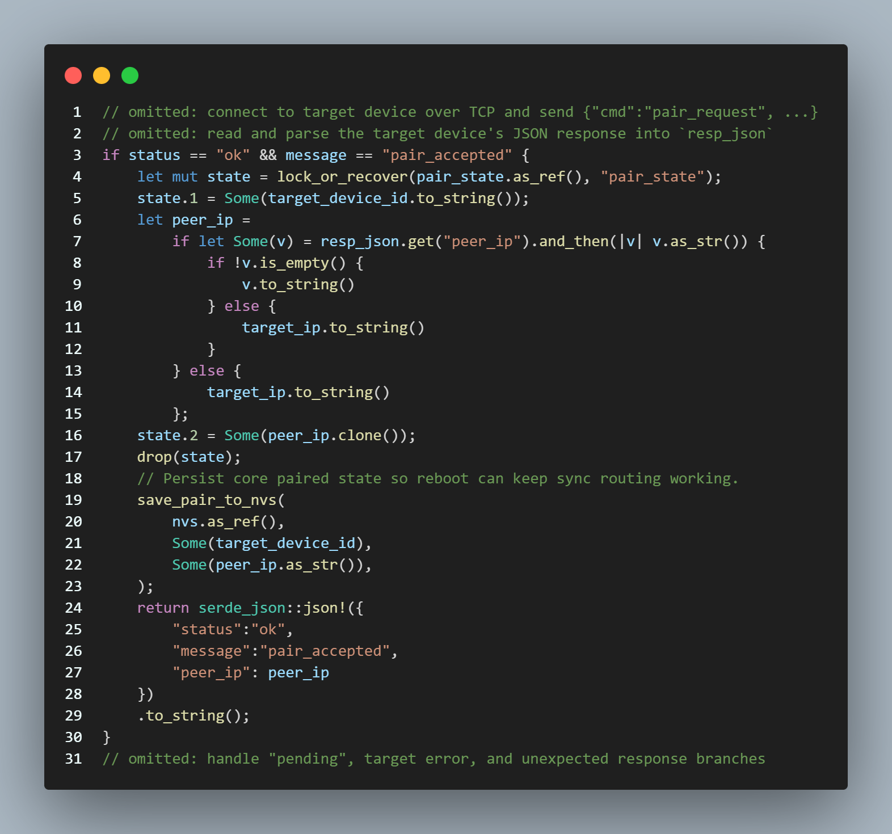

Kickstarter Video: https://youtu.be/o-Wq5kcca9Q​

# Butterfly Effect Installation
Matilda Nelson,
Yitong Wu,
Yuqian Lin.

## Introduction
The capacity to communicate across distance has expanded significantly, yet the experience of shared physical presence remains difficult to replicate. While messaging and video calls enable efficient exchange, they often fail to convey the feeling of another person’s presence within one’s physical space. This challenge lies at the core of Connected Environments, which explores how digital systems and IoT technologies can bridge people and places.

This project was developed within the Connected Environments Group Prototype and Pitch, focusing on communicating presence through non-screen-based interaction. Ishii and Ullmer’s concept of Tangible Bits provides a key foundation, demonstrating how digital information can be embedded in physical artefacts to support embodied interaction (Ishii & Ullmer, 1997). The project also draws on animistic design principles, using lifelike motion to evoke the presence of another person.

This project, Butterfly Effect, proposes a networked interactive installation that transforms human presence into a tangible physical signal.
### The Problem
How can presence be made tangible across distance?

## Concept
The Butterfly Effect Installation is inspired by the butterfly effect metaphor, where small actions can produce significant outcomes in interconnected systems (Lorenz, 1963). This concept is translated into an interaction design connecting two remote installations.

Each butterfly is paired with a counterpart in another location. When a user interacts with one installation, both butterflies respond simultaneously through wing motion. In addition to immediate feedback, rotation represents accumulated presence over time.

Rather than transmitting explicit information, the system enables presence to be perceived indirectly through motion. This aligns with research suggesting that non-verbal interaction can enhance emotional connection (van Erp & Toet, 2015).

## How It Works

  
 
 <em>Fig. 1. Butterfly device system layout</em> 

At Location A, a distance sensor maps proximity to wing motion. This signal is transmitted to the paired device at Location B, which replicates the motion and adds rotational feedback.

By combining real-time feedback (flapping) with longer-term representation (rotation), the system enables both immediate and accumulated expressions of presence. The modular design allows multiple butterflies to operate simultaneously.

## Design Process

### Hardware and Mechanism
The physical design of the butterfly installation was developed around three requirements: detecting human presence, producing visible wing movement, and remaining compact enough to be mounted as part of a wall-based installation. The system therefore combines sensing, computation, and actuation within a small embedded device.

    
 
 <em>Fig. 2. Hardware components used in the prototype</em> 

The XIAO ESP32C3 was selected as the main controller because it provides compact size, Wi-Fi capability, and sufficient GPIO support for the sensor and actuators. A VL53L0X/VL53L1X time-of-flight distance sensor was used to detect user proximity, allowing the system to respond not only to whether someone is present, but also to how close they are. This was important because the interaction was designed as a continuous signal rather than a simple on/off trigger.

Two servo motors were used to create different layers of feedback. The SG92R positional servo controls the flapping of the butterfly wings, providing immediate feedback when presence is detected. The SG90-HV continuous rotation servo was included to represent accumulated interaction over time through slow rotation. This separation between flapping and rotation allowed the installation to communicate both instant presence and longer-term traces of activity.

The mechanism design evolved significantly during the project. Early versions explored a DC motor and hinge-based mechanism, but this approach made precise control difficult. The design therefore shifted toward a servo-based mechanism, which allowed more predictable wing movement and better control through code.

  
 
 <em>Fig. 3. Mechanism development</em> 

The enclosure was developed through 3D modelling to accommodate the microcontroller, servos, sensor, wiring, and wing structure. The model had to balance technical constraints with the visual character of the object. Since the butterfly was intended to feel expressive rather than purely functional, the enclosure needed to hide the electronics while still supporting visible mechanical motion.

  
 
 <em>Fig. 4. 3D enclosure model</em> 

This modelling process showed how closely mechanical design, electronics, and interaction logic were connected. Changes in motor choice affected the enclosure, while the available space inside the body affected wiring and assembly. As a result, the form of the butterfly was not only aesthetic, but directly shaped by the technical requirements of the system.

### Interaction and System Design
The interaction design was based on the idea of turning human presence into an ambient physical signal. Instead of using screens, text, or notifications, the system communicates through subtle movement. When a person approaches one butterfly, the wings flap; when the interaction continues, rotation provides a slower record of accumulated presence.

The system was designed to work as a pair of connected devices. Each butterfly has its own sensor, microcontroller, and actuators, making the installation modular. This means that multiple butterflies can be arranged on one wall and paired with butterflies in another location. When triggered, several butterflies could respond simultaneously, making the feeling of presence more visible and spatial.

A mobile application was included because the devices have no screen or onboard interface. The app supports setup, Wi-Fi configuration, device discovery, and pairing. This avoids requiring users to manually configure the device through a browser or command-line interface, making the prototype easier to use and demonstrate.

The communication design separates setup from normal operation. During setup, the device opens a temporary Soft-AP so the user can send Wi-Fi credentials through the app. After this, the device joins the local network in STA mode. UDP is used for lightweight discovery and status updates, while TCP is used for control commands and pairing. This structure was chosen to keep discovery and direct control separate, improving clarity in the system architecture.
## Development Process
The development process followed an iterative approach, evolving from early mechanical prototypes to a fully integrated system. 

Initial tests explored wing movement using a DC motor, which was later replaced with a servo motor to improve control and stability. Material testing led to the selection of ripstop fabric for its balance of flexibility and structure. 

As development progressed, sensing, actuation, and networking components were integrated through repeated testing and refinement, resulting in a reliable and cohesive system.

### System and Communication

  
 
 <em>Fig. 5. System workflow</em> 

The system implementation integrates embedded software on the ESP32 with a Flutter mobile application, forming a distributed architecture that supports sensing, actuation, and remote interaction.

On the embedded side, the ESP32 is responsible for handling distance sensing, servo control, and network communication. The distance sensor continuously measures proximity and provides input to the control logic, which maps the sensed values to motion parameters such as flapping speed and timing. This mapping enables a continuous interaction rather than a simple binary trigger.

The system uses a two-stage communication workflow. During setup, the device operates in Soft-AP mode, allowing the mobile application to connect directly and transmit Wi-Fi credentials. Once configured, the device switches to STA mode and joins the local network, enabling normal operation.

Communication is divided into two channels. UDP is used for lightweight broadcasting of device status and discovery, allowing the mobile application to detect available devices on the network. TCP is used for control operations, including device configuration, pairing requests, and interaction commands. This separation ensures that continuous status updates do not interfere with critical control messages.

The pairing mechanism enables two devices to form a persistent connection. Once paired, local sensing events trigger synchronised behaviour on the remote device. This is achieved by transmitting motion-related parameters, allowing the paired device to replicate the interaction in real time. The system therefore supports a distributed interaction model, where local physical activity is translated into remote mechanical feedback.

  

  <em>Fig. 8. Device pairing and synchronised interaction sequence</em>

The mobile application supports device onboarding, network configuration, and pairing, providing a simple interface for users to connect and manage butterfly devices without requiring manual network setup.

  
  
  

  

  <em>Fig. 11. Pairing logic and remote response flow between two butterfly devices.</em>

The mobile application supports device onboarding, network configuration, and pairing, providing a simple interface for users to connect and manage butterfly devices without requiring manual network setup.

### Hardware Implementation
The hardware connections were implemented as follows: the VL53L0X/VL53L1X distance sensor was connected to the XIAO ESP32C3 via the I²C interface, using D0 as SCL and D3 as SDA. Two servo motors were connected to PWM-capable pins, with the SG92R servo (wing flapping) connected to D1 and the SG90-HV continuous rotation servo (rotation) connected to D2. Power and ground were shared across all components to ensure stable operation.

  

  <em>Fig. X. Circuit connection layout</em>

The circuit was assembled through manual wiring and soldering. Due to the compact size of the ESP32C3 board, component placement and wiring had to be carefully arranged to avoid interference and maintain stable connections.

  

  <em>Fig. X. Soldered circuit</em>

During implementation, particular attention was required for power connections, as the small VBAT pads made soldering difficult. This influenced the final power design and required adjustments to the overall system layout.

### Assembly and Integration

  
  

  <em>Fig. 6. Assembly of the butterfly device based on the 3D model</em>

Following the 3D modelling stage, the components were physically assembled into the enclosure. This stage involved integrating the microcontroller, servos, and distance sensor within the constrained internal space of the butterfly body.

The assembly process highlighted practical challenges such as limited space for wiring, alignment of mechanical parts, and stability of component connections. Adjustments were required to ensure that the wing mechanism could move freely while maintaining a compact and stable structure.

## Final Prototype execution

  

  <em>Fig. 8. Final prototype</em>

The final prototype successfully integrates sensing, actuation, and communication into a compact physical device. When tested in a real-world setting, the system was able to detect user presence and trigger both local and remote responses, demonstrating the core concept of translating physical activity into a perceivable signal across distance.

The wing flapping behaviour performed reliably and provided clear real-time feedback. The relationship between user proximity and motion speed was observable and intuitive, allowing users to understand how their movement influenced the system.

In contrast, the rotational feedback was less consistent. While the system demonstrated the intended behaviour, the motion was not always stable or clearly interpretable as a long-term representation of presence.

From an interaction perspective, the system created a subtle sense of connection between two spaces. However, the range of behaviours remained limited, and the interaction could become repetitive over time. This reduced the system’s ability to convey more nuanced or varied forms of presence.

Overall, the prototype demonstrates that the core concept is technically feasible and perceptually understandable, but the expressiveness of the interaction remains limited.

## Challenges
The development of the Butterfly Effect installation revealed a series of interconnected challenges that affected both technical performance and the quality of interaction.

**1. Power management**  
A primary limitation was power management. The system was initially designed to operate using a compact Li-ion battery, but the small and fragile VBAT interface on the XIAO ESP32C3 made stable integration difficult. This led to unreliable connections and potential safety risks. As a result, an external power bank was used, which improved stability but introduced additional weight and restricted movement.

**2. Mechanical precision and control**  
The use of a continuous rotation servo required time-based control rather than positional feedback, leading to inconsistencies in rotation. This reduced the system’s ability to accurately represent accumulated presence over time.

**3. Communication and synchronisation**  
Maintaining synchronised behaviour between paired devices required frequent updates, placing a significant load on the ESP32-C3. When sensing, actuation, and communication occurred simultaneously, delays or instability could arise.

**4. Provisioning and usability**  
The transition from Soft-AP setup to normal Wi-Fi operation depended on the behaviour of the user’s mobile device, which could not always be controlled programmatically. This sometimes required manual reconnection, reducing the smoothness of the user experience.

These challenges highlight how hardware, software, and interaction design are tightly coupled, where limitations in one component influence overall system performance.

## Improvements
Based on the identified challenges, several targeted improvements can be proposed.

**1. Improved power system**  
To address the limitations in power management, the system could integrate a dedicated battery management module and use a more robust power interface. Implementing low-power strategies such as deep sleep modes would also reduce energy consumption, enabling stable and portable operation without relying on an external power bank.

**2. Enhanced mechanical precision and control**  
To improve mechanical accuracy, the continuous rotation servo could be replaced with stepper motors or feedback-controlled servos. These alternatives would provide more precise and repeatable motion, allowing the system to more effectively represent accumulated presence over time.

**3. More efficient communication and synchronisation**  
To reduce system load, the communication strategy could be optimised by decreasing the frequency of synchronisation updates and adopting more lightweight protocols. This would maintain the perception of real-time interaction while improving system stability and responsiveness.

**4. More reliable provisioning and user experience**  
To improve usability, the provisioning process could include better reconnection logic and clearer feedback during network transitions. Enhancing the app’s ability to rediscover devices after setup would reduce the need for manual intervention and create a smoother user experience.

In addition to these technical improvements, future iterations could explore richer interaction behaviours—such as varying motion patterns, speed, or rhythm—to enhance the expressive and emotional quality of the system.

## Reflections
This project demonstrates the potential of physical computing to support remote, embodied interaction. By translating human presence into physical motion, it offers an alternative to screen-based communication and explores more ambient forms of connection.

However, a critical gap remains between conceptual ambition and technical implementation. While inspired by the butterfly effect, the system primarily indicates activity rather than fully conveying presence. The interaction successfully signals that “someone is there,” but it does not always communicate the richness or emotional nuance of that presence.

This raises a broader question about the effectiveness of minimal physical signals in expressing complex human connection. While subtlety aligns with the project’s design intention, it can also lead to ambiguity, particularly when the interaction lacks variation or contextual cues.

The project highlights the need to balance simplicity, expressiveness, and technical feasibility in Connected Environments. While reducing interaction to minimal physical cues creates a calm and ambient experience, it also limits the amount of information that can be communicated.

Despite these limitations, the project demonstrates that even simple physical interactions can create meaningful connections across distance. It provides valuable insight into how IoT systems can move beyond information exchange to support more experiential and emotionally aware forms of communication.

### Team Contributions
Wu Yitong: Hardware design and circuit integration, including wiring, assembly, system testing, and report writing.

Lin Yuqian: Software development, including the mobile app, ESP32 communication, system integration, and report writing.

Matilda Nelson: 3D modelling and fabrication, including the butterfly enclosure, laser-cut wings, video production, and report writing.

### References
	Ishii, H. and Ullmer, B. (1997) 'Tangible bits: Towards seamless interfaces between people, bits and atoms', Proceedings of the SIGCHI Conference on Human Factors in Computing Systems (CHI '97), pp. 234–241.

	Thompson, S.A., Kennedy, R., and Lomas, D. (2011) 'Ambient awareness: From random noise to digital closeness in social media', Proceedings of the SIGCHI Conference on Human Factors in Computing Systems, pp. 237–246.

	van Erp, J.B.F. and Toet, A. (2015) 'Social touch in human–computer interaction', Frontiers in Digital Humanities, 2(2), pp. 1–13.

	Lorenz, E.N. (1963) 'Deterministic nonperiodic flow', Journal of the Atmospheric Sciences, 20(2), pp. 130–141.
