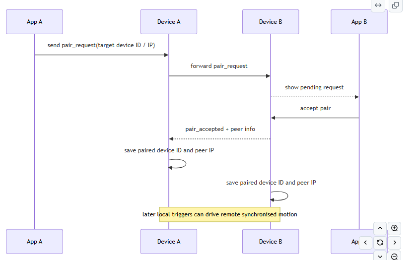

Kickstarter Video: https://youtu.be/o-Wq5kcca9Q​

# Butterfly Effect Installation
Matilda Nelson,
Yitong Wu,
Yuqian Lin.

## Introduction
The capacity to communicate across distance has expanded significantly, yet the experience of shared physical presence remains difficult to replicate. While messaging and video calls enable efficient exchange, they often fail to convey the feeling of another person’s presence within one’s physical space. This challenge lies at the core of Connected Environments, which explores how digital systems and IoT technologies can bridge people and places.

This project was developed as part of the Connected Environments Group Prototype and Pitch 25/26, with the brief to design a device or service that connects people across the miles.
Within this project, we were centrally concerned with communicating physicality through non-screen-based technology. Ishii and Ullmer's concept of Tangible Bits provided a foundational reference point, establishing that digital information can be embedded in physical artefacts to engage the body and environment rather than the screen alone (Ishii & Ullmer, 1997). Our project also draws on animism to translate the feeling of presence, by using the physical movement of something that looks alive to convey the sense of another person being in the room with you.

This project, Butterfly Effect, proposes a networked interactive installation that transforms human presence into a tangible physical signal.

### The Problem
How can presence be made tangible across distance?

## Concept
Inspired by the butterfly effect metaphor from chaos theory, this concept provides a theoretical framing where small initial actions can lead to disproportionate outcomes in complex systems (Lorenz, 1963). This concept is translated into an interaction design connecting two remote installations.

Two butterfly walls exist at two different locations. Each butterfly is paired with a counterpart in another location and has a distance sensor to detect interaction. When a person moves past their installation both paired butterflies flutter simultaneously. Sitting at home, you might look up and see them flutter from left to right, meaning your loved one just moved through the space. In addition to this immediate feedback, rotation represents accumulated presence over time. If the butterflies are rotated in different directions, someone has been there; if they are all aligned, they have not.
Rather than transmitting explicit information, the installation enables presence to be perceived indirectly through motion, something you notice in the corner of your eye rather than something you read. Research in mediated social touch suggests that non-verbal and haptic interaction can enhance emotional connectedness in remote communication more effectively than information-dense channels alone (van Erp & Toet, 2015).

## How It Works

  
 
 <em>Fig. 1. Butterfly device system layout</em> 

At Location A, a distance sensor detects the user's distance and maps it to the flapping frequency of the butterfly wings, with closer proximity resulting in faster motion. This signal is transmitted to the paired device at Location B, which replicates the flapping behaviour and additionally rotates butterfly B, encoding the duration of interaction over time

By combining immediate feedback (flapping) with longer-term representation (rotation), the system enables both instant and accumulated expressions of presence. Each butterfly has its own independent microcontroller, sensor and actuators, meaning the installation is modular and accumulative butterfly units can be arranged on a wall to respond simultaneously, amplifying the three dimensional effect of presence in the space, creating a 'Butterfly mirror' of movement.

## Design Process

### Hardware and Mechanism
The physical design of the butterfly installation was developed around three requirements: detecting human presence, producing a visible 'aliveness' through wing movement, and remaining compact enough to be mounted as part of a wall installation. The system therefore combines sensing, computation, and actuation within a very small embedded device.

    
 
 <em>Fig. 2. Hardware components used in the prototype</em> 

The XIAO ESP32C3 was selected as the main controller for its compact size, built-in Wi-Fi capability, and sufficient GPIO support. A VL53L0X/VL53L1X time-of-flight sensor was used to detect user proximity, enabling the system to respond continuously rather than through a simple on/off trigger.

Two servo motors provided layered feedback: an SG92R positional servo for wing flapping as immediate response, and an SG90-HV continuous rotation servo to represent accumulated interaction over time. This combination allowed the system to communicate both real-time presence and longer-term activity.

The design of the butterfly mechanism and enclosure evolved significantly throughout the project. As an IoT device integrating both mechanical and digital components, the hardware, structure, and code were tightly coupled and continuously adapted.
Early versions explored a DC motor and hinge-based mechanism, but this approach made precise control difficult. The design therefore shifted toward a servo-based mechanism, which allowed more predictable wing movement and better control through code.

  
 
 <em>Fig. 3. Mechanism development</em> 

The enclosure was developed through 3D modelling to fit the microcontroller, servos, sensor, wiring, and wing structure. Because the servo had to be integrated directly into the wing assembly, the body went through repeated redesigns to become compact enough to hide the electronics, while still looking like a butterfly and allowing the wings to move naturally. As a result, the form of the butterfly was not only aesthetic, but directly shaped by the technical requirements of the system.

  
 
 <em>Fig. 4. 3D enclosure model</em> 

### Interaction and System Design

The system required a mobile application because the devices have no screen or onboard interface. The app supports setup, Wi-Fi configuration, device discovery, and pairing. This avoids requiring users to manually configure the device through a browser or command-line interface, making the prototype easier to use and demonstrate.

The communication design separates setup from normal operation. During setup, the device opens a temporary Soft-AP so the user can send Wi-Fi credentials through the app. After this, the device joins the local network in STA mode. UDP is used for lightweight discovery and status updates, while TCP is used for control commands and pairing. This structure was chosen to keep discovery and direct control separate, improving clarity in the system architecture.

## Development Process

Initial tests explored wing movement using a DC motor, which was later replaced with a servo motor to improve control and stability. After experimenting with paper, card, leaves, and a range of fabrics for the wings, the material needed to balance flexibility and structure: it had to be supple enough to produce a subtle “flop” or “flutter” in motion, while remaining rigid enough to hold an upright form and retain its shape. Ripstop fabric best satisfied these requirements. The wings were laser-cut from this material and subsequently heat-pressed to fix the pleats, ensuring the folds held their intended form during movement. As development progressed, sensing, actuation, and networking components were integrated through repeated testing and refinement, resulting in a reliable and cohesive system.

### System and Communication

  
 
 <em>Fig. 5. System workflow</em> 

The system integrates embedded software on the ESP32 with a Flutter mobile application, forming a distributed architecture that supports sensing, actuation, and remote interaction. On the embedded side, the ESP32 handles distance sensing, servo control, and network communication. The distance sensor continuously measures proximity and maps values to motion parameters such as flapping speed and timing, enabling a continuous response rather than a simple binary trigger.

Communication follows a two-stage workflow. During setup, the device operates in Soft-AP mode, allowing the app to connect directly and transmit Wi-Fi credentials. Once configured, it switches to STA mode and joins the local network. Communication is then divided into two channels: UDP for lightweight status broadcasting and device discovery, and TCP for control operations including configuration, pairing, and interaction commands. This keeps status updates from interfering with critical control messages.

The pairing mechanism enables two devices to form a persistent connection. Once paired, local sensing events trigger synchronised behaviour on the remote device by transmitting motion-related parameters, allowing it to replicate the interaction in real time. The system therefore supports a distributed interaction model, where local physical activity is translated into remote mechanical feedback.

  

  <em>Fig. 6. Device pairing and synchronised interaction sequence</em>

The mobile application supports device onboarding, network configuration, and pairing, providing a simple interface for users to connect and manage butterfly devices without requiring manual network setup.

  
  
  

  <em>Fig. 7. Screens from the mobile application showing device discovery, Wi-Fi provisioning, and the control/pairing interface.</em>

### Hardware Implementation
The hardware connections were implemented as follows: the VL53L0X/VL53L1X distance sensor was connected to the XIAO ESP32C3 via the I²C interface, using D0 as SCL and D3 as SDA. Two servo motors were connected to PWM-capable pins, with the SG92R servo (wing flapping) connected to D1 and the SG90-HV continuous rotation servo (rotation) connected to D2. Power and ground were shared across all components to ensure stable operation.

  

  <em>Fig. 8. Circuit connection layout</em>

The circuit was assembled through manual wiring and soldering. Due to the compact size of the ESP32C3 board, component placement and wiring had to be carefully arranged to avoid interference and maintain stable connections.

  

  <em>Fig. 9. Soldered circuit</em>

During implementation, particular attention was required for power connections, as the small VBAT pads made soldering difficult. This influenced the final power design and required adjustments to the overall system layout.

### Assembly and Integration

  
  

  <em>Fig. 10. Assembly of the butterfly device based on the 3D model</em>

The constraints of the enclosure made assembly inherently complicated. Limited internal space, the alignment of mechanical parts, and the stability of component connections all required careful adjustment to ensure the wing mechanism could move freely within the compact structure.

## Final Prototype execution

  

  <em>Fig. 11. Final prototype</em>

The final prototype successfully integrated a microcontroller, two servos, a distance sensor, and a battery (which was ultimately not used) into a compact enclosure housed beneath the wing structure. The device was able to detect user presence and trigger both local and remote responses, demonstrating the core concept of translating physical activity into a perceivable signal across distance.

The wing flapping worked reliably and it was clear to users that their movement was having an effect, with the wings responding faster the closer they got. In contrast, the rotational feedback was less consistent. While the system demonstrated the intended behaviour, the rotational motion was not always stable or easy to read as a record of presence over time. This was compounded by power issues across several butterflies: the initial attempt to use a 3.7V 400mAh Li-ion battery was unsuccessful due to the small, closely spaced VBAT pads on the XIAO ESP32C3, which made soldering difficult and prone to short circuits, in several cases causing overheating and battery damage. A power bank was used instead, providing stable power, but as the enclosure had not been designed to accommodate it, the added size and weight prevented the butterfly from rotating freely. As a result, the rotational feature could not be fully or accurately evaluated.

From an interaction perspective, the system created a sense of connection between two spaces. As a physical object, the butterfly was engaging in a way that went beyond functional feedback, the experience of it moving as if alive, responding to proximity as though aware of your presence, produced a genuine sense of animism. This quality of imbuing a communication device with the feeling of life was successful and helped to realy the felt sense of another person's being. However, the range of behaviours remained limited and the interaction could become repetitive over time, reducing the system's ability to convey nuanced or varied forms of presence. Overall, the prototype demonstrates that the core concept is technically feasible and perceptually understandable, but there is room to develop the expressiveness of the interaction.

## Challenges

**1.Power management**

The system was designed to operate using a compact Li-ion battery, but the small and fragile VBAT interface on the XIAO ESP32C3 made stable integration difficult, leading to unreliable connections and safety risks. An external power bank was used instead, which improved stability but introduced additional weight and restricted movement.

**2. Mechanical precision and control**

The continuous rotation servo required time-based control rather than positional feedback, leading to inconsistencies in rotation and reducing the system's ability to accurately represent accumulated presence over time.

**3. Communication and synchronisation**

Maintaining synchronised behaviour between paired devices required frequent updates, placing a significant load on the ESP32-C3. When sensing, actuation, and communication occurred simultaneously, delays or instability could arise.

**4. Provisioning and usability**

The transition from Soft-AP setup to normal Wi-Fi operation depended on the behaviour of the user's mobile device, which could not always be controlled programmatically, sometimes requiring manual reconnection.

## Improvements

**1. Improved power system**

The system could integrate a dedicated battery management module and more robust power interface, alongside low-power strategies such as deep sleep modes, enabling stable and portable operation without relying on an external power bank.

**2. Enhanced mechanical precision and control**

Replacing the continuous rotation servo with stepper motors or feedback-controlled servos would provide more precise and repeatable motion, allowing the system to more effectively represent accumulated presence over time.

**3. More efficient communication and synchronisation**

Decreasing the frequency of synchronisation updates and adopting more lightweight protocols would reduce system load while maintaining the perception of real-time interaction and improving overall stability.

**4. More reliable provisioning and user experience**

Improved reconnection logic and clearer feedback during network transitions would reduce the need for manual intervention, making setup smoother and the app more reliable at rediscovering devices.

## Reflections

The Butterfly Effect installation demonstrates that imbuing a physical object with the feeling of life, using animism as a method of communicating presence, can create a meaningful sense of connection across distance. However, a gap remains between the conceptual ambition and what the system was able to express. While it successfully signals presence, the range of behaviours was limited and the interaction could become repetitive over time.
In retrospect, the purpose of the installation was not defined clearly enough from the start. If the goal was to communicate presence between two specific people, a single more developed butterfly with a richer set of features, different flapping rhythms meaning different things, additional actuators, would have served that better. If the goal was instead to create an ambient sense of presence within a space, the wall format makes more sense, but as a cultural or public installation rather than a consumer product, where the cost and installation method are more appropriate and power could be resolved by integrating directly into a wall. The two directions call for quite different objects, and trying to serve both may have limited how well the project achieved either.

### Team Contributions

Wu Yitong: Hardware design and circuit integration, including wiring, assembly, system testing, and report writing.

Lin Yuqian: Software development, including the mobile app, ESP32 communication, system integration, and report writing.

Matilda Nelson: 3D modelling and fabrication; including the butterfly enclosure, mechanism, laser-cut wings and assembly. video production; planning, filming and editing, and report writing.

### References
	Ishii, H. and Ullmer, B. (1997) 'Tangible bits: Towards seamless interfaces between people, bits and atoms', Proceedings of the SIGCHI Conference on Human Factors in Computing Systems (CHI '97), pp. 234–241.

	Thompson, S.A., Kennedy, R., and Lomas, D. (2011) 'Ambient awareness: From random noise to digital closeness in social media', Proceedings of the SIGCHI Conference on Human Factors in Computing Systems, pp. 237–246.

	van Erp, J.B.F. and Toet, A. (2015) 'Social touch in human–computer interaction', Frontiers in Digital Humanities, 2(2), pp. 1–13.

	Lorenz, E.N. (1963) 'Deterministic nonperiodic flow', Journal of the Atmospheric Sciences, 20(2), pp. 130–141.
