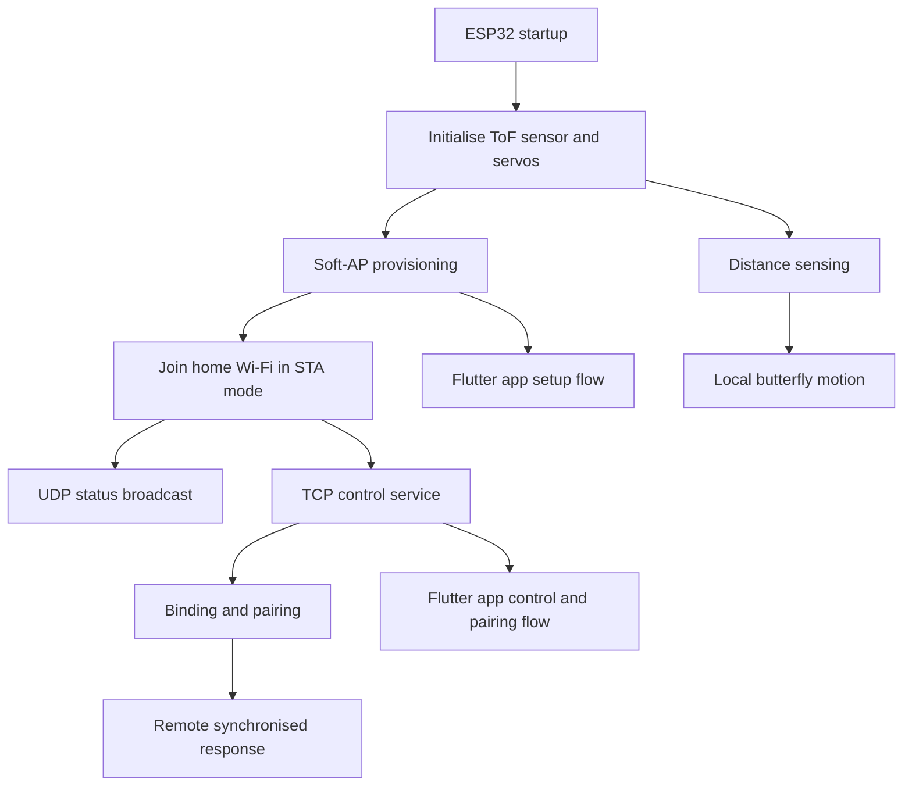
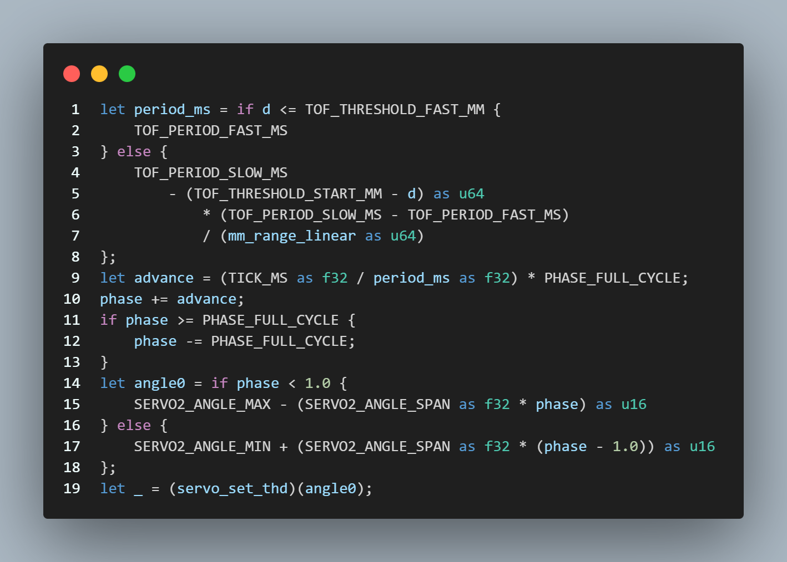
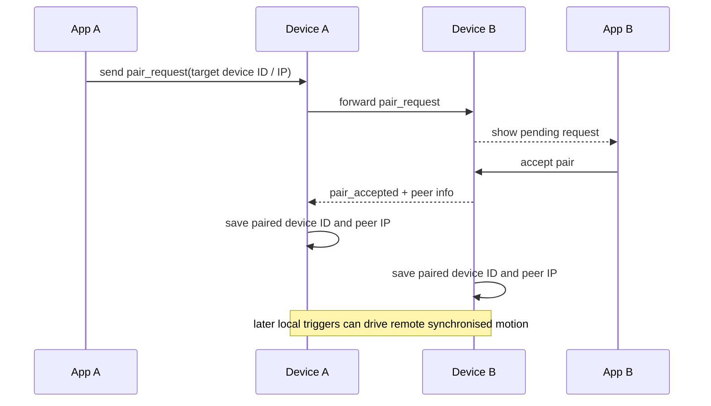

Kickstarter Video: https://youtu.be/o-Wq5kcca9Q​

# Butterfly Effect Installation
Matilda Nelson,
Yitong Wu,
Yuqian Lin.

## Introduction

  The capacity to communicate at a distance has expanded enormously but the experience of shared physical presence has proven considerably harder to replicate. While messaging and video calls enable efficient exchange, they often fail to convey an important dimension of human connection: the feeling of another person’s presence within one’s physical space. This challenge sits at the heart of Connected Environments which investigates how digital systems and IoT technologies can bridge people and places across distance. This project was developed as part of the Connected Environments Group Prototype and Pitch 25/26, with the brief to design a device or service that connects people across the miles.

Within this project, we were centrally concerned with communicating physicality through non-screen-based technology. Ishii and Ullmer's concept of Tangible Bits provided a foundational reference point, establishing that digital information can be embedded in physical artefacts to engage the body and environment rather than the screen alone (Ishii & Ullmer, 1997). The project also draws on animism to translate the feeling of presence, by using the physical movement of something that looks alive to convey the sense of another person being in the room with you.

This project, Butterfly Effect, addresses presence by proposing a networked interactive installation that transforms human presence into a tangible, physical signal.

### The Problem

How can presence be made tangible across the miles?

## Concept

The Butterfly Effect Installation

Inspired by the butterfly effect metaphor from chaos theory, this concept provides a theoretical framing where small initial actions can lead to disproportionate outcomes in complex systems (Lorenz, 1963). This principle is translated into interaction design and reinterpreted through remote communication: when a person moves past their installation, the butterfly on their paired device rotates creating a cumulative record of presence throughout the day. If the butterflies are all rotated, the other person has been there; if they are all aligned, they have not. When either person interacts, both butterflies flutter simultaneously sharing a live signal of connection. The butterfly is therefore positioned as both a symbol and a mechanism, through which minor everyday actions in one place generate a meaningful emotional effect elsewhere.

The Butterfly Effect installation transforms presence into a physical, perceivable signal through an installation of paired of networked butterfly devices. When a user approaches one device, both respond through synchronous wing movement and rotation. By shifting communication from explicit information exchange to embodied environmental feedback, the installation explores alternative ways of mediating connection at a distance. Rather than transmitting messages or images, it asks whether presence itself ( the simple fact of someone having been somewhere, or being there now) can be felt through a physical object. This moves the register of communication from the cognitive to the atmospheric: something you notice in the corner of your eye rather than something you read. Research in mediated social touch supports this direction, suggesting that non-verbal and haptic interaction can enhance emotional connectedness in remote communication more effectively than information-dense channels alone (van Erp & Toet, 2015)

## How It Works

  

  <em>Fig. 1. Butterfly device system layout</em>

The system layout (Fig. 1) presents a networked interaction between two butterfly devices located in separate spaces and connected via the internet. Each device integrates sensing, communication, and actuation to enable real-time, bidirectional interaction.

At Location A, a proximity sensor detects the user’s distance and maps it to the flapping frequency of the butterfly wings, with closer proximity resulting in faster motion. This interaction data is then transmitted to the paired device.

At Location B, the butterfly responds by synchronizing its flapping behavior and additionally provides feedback through rotation along its wall-mounted base. This tangential movement encodes the duration or accumulation of interactions over time.

The spatial separation highlights the core concept of translating local physical actions into remote, perceivable effects. By combining immediate feedback (flapping) with longer-term representation (rotation), the system enables both instant and accumulated expressions of presence. Multiple butterfly units can also be arranged on a wall to respond simultaneously, amplifying the perceived effect.

## Design Process

### Hardware 

  
  
  

  <em>Fig. 2. Hardware</em>

The system was built around the XIAO ESP32C3 (Fig. 2), which provides both computation and wireless communication. A VL53L0X/VL53L1X (Fig. 2) time-of-flight sensor was used to detect human presence by measuring distance. Two servo motors were used for actuation: an SG92R servo (Fig. 2) drives the flapping of the butterfly wings, while an SG90-HV continuous servo provides rotational feedback to represent the duration of interaction.

All components were integrated into a 3D-printed butterfly enclosure with fabric wings, combining functional design with an expressive physical form.

### System workflow

  

  <em>Fig. 3. System workflow</em>

During operation, the sensor continuously monitors distance. When a user was detected, the ESP32C3 triggered the local wing motion and simultaneously sends a signal via the mobile application to a paired remote device. The remote butterfly then replicated the flapping motion and rotated proportionally to the duration of presence, enabling a real-time mapping from physical presence to mechanical feedback across distance. (Fig. 3)

### The app  
The mobile application was developed as the main interface between the user and the butterfly devices. As the devices themselves have no screen or onboard controls, the app was needed to support setup, device management, and pairing. In practice, it was used to bring devices online, check whether they were reachable on the network, test motor behaviour during development, and connect one butterfly to another.

  
  
  

  <em>Fig. 4. Screens from the mobile application showing device discovery, Wi-Fi provisioning, and the control/pairing interface.</em>

Its first role was Wi-Fi provisioning. During setup, each ESP32 device opened a temporary Soft-AP, which allowed the app to find it by its hotspot prefix and connect to it directly. The app then identified the device and sent the Wi-Fi credentials needed for the device to join the home network. Once this was completed, the device closed its Soft-AP and switched to STA mode. After joining the local network, the device broadcast its presence so that the app could update its IP address, monitor whether it was online, and maintain communication for later control.

The second role of the app was pairing and binding. This was necessary because the project was not intended as a standalone interactive object, but as a linked system between two distant users. If one user had a device and another user had a second device, the two could be paired by sharing and entering the target device ID in the app. After binding, the devices could operate together, allowing activity detected in one location to produce movement and response in the other.

This Soft-AP to provisioning to STA workflow was adopted for practical reasons. The devices needed internet connectivity in order to support communication over long distances rather than only within a single local network. It also simplified the setup process. A browser-based method would have required users to manually join the device hotspot, open a configuration page, and then search again for the device after it reconnected to Wi-Fi with a new IP address. By handling these steps through a single mobile app, the system made setup, control, and pairing more manageable for non-technical users and more efficient during prototyping.

### The mechanism

The design of the butterfly mechanism and enclosure evolved significantly throughout the project (Fig. 5). As an IoT device integrating both mechanical and digital components, the hardware, structure, and code were tightly coupled and continuously adapted.

  <em>Fig. 5. Designing the butterfly mechanism</em>

Initially, a DC motor was used, resulting in a hinge-based wing system driven by continuous rotation. This was later replaced by a servo motor, shifting the mechanism to angle-based movement, which required corresponding modifications to the control code.

  
  
  

  <em>Fig. 6. 3D enclosure model</em>

This transition also impacted the enclosure design, as the servo had to be directly integrated into the wing assembly. The overall body therefore became more compact, with repeated redesigns to accommodate the updated mechanical and electronic layout.​ (Fig. 6)

## Development Process

### Wiring and soldering

  

  <em>Fig. 7. Circuit connection layout</em>

The circuit was centered around the XIAO ESP32C3, which serves as the main controller for sensing, processing, and communication. A VL53L0X/VL53L1X distance sensor is connected via I²C (D0 as SCL, D3 as SDA) to detect human presence in real time. Two servo motors act as outputs: the SG92R servo (connected to D1) controls wing flapping, while the SG90-HV continuous servo (connected to D2) provides rotational motion to represent interaction duration. Both servos are driven by PWM signals from the microcontroller. (Fig. 7)

  

  <em>Fig. 8. Soldered circuit</em>

The circuit was then soldered together (Fig. 8).

#### Overall structure
The software has two main parts. One runs on the ESP32 and handles sensing, actuation, and device-to-device communication. The other is a Flutter mobile application for setup, device management, and pairing. Both follow the same interaction flow. The embedded software, written in Rust, coordinates Wi-Fi, sensors, servos, and communication services through a central system module. The mobile app exposes those functions through a setup and control interface.

#### Embedded control and motion logic
The ESP32 code is organised around a central system module. On startup, the program first initialises the ToF sensor, then the two servos, and only after that starts Wi-Fi and the related network services. Because two different ToF sensors were used during prototyping, the code first attempts to initialise the VL53L0X and falls back to the VL53L1X if that fails. The two servos are controlled through a shared LEDC timer. This keeps sensing, actuation, and communication in the same embedded program, while still allowing the network and provisioning functions to remain available if part of the hardware fails to initialise.

The local interaction logic is driven by the distance readings from the ToF sensor. A background control thread continuously reads the measured distance and adjusts both servo angle and motion period in response to how close the user is to the device. When a person approaches, the wings move faster; when the person moves away, the mechanism returns to an idle state. The response is therefore not a simple binary trigger. It changes continuously with proximity, which better matches the project's aim of expressing presence through movement (Fig. 9).

  

  <em>Fig. 9. Servo control logic used to translate distance sensing into butterfly motion.</em>

#### Provisioning and communication logic
The networking code is divided into two stages. The first is provisioning. When the device starts, it opens a temporary Soft-AP so that the mobile app can connect to it. At this stage, the device accepts JSON commands such as `identify` and `config` over TCP and uses the supplied Wi-Fi credentials to join the home network. Once the connection succeeds, the device switches to STA mode and starts a second set of communication services: UDP broadcasts for discovery and status reporting, and a TCP control service for binding, unbinding, motor testing, pairing requests, and status queries.

This workflow does more than bring the device online. It also supports the control and pairing steps that follow. The mobile app follows the same protocol as the embedded code: it scans for device hotspots, connects during setup, sends Wi-Fi credentials, and then continues to listen for device status and send control commands after the device rejoins the local network. The app also stores device records locally, tracks discovered IP addresses, polls pair status, and presents incoming pairing requests through the interface. In practice, it is part of the system's configuration, management, and pairing process rather than a separate display layer (Fig. 10).

  

  <em>Fig. 10. Provisioning and communication flow from Soft-AP setup to STA-mode operation.</em>

#### Pairing and remote response
The pairing logic extends the system beyond a single responsive object. Before pairing, each device responds only to its own sensor input. After pairing, the same local trigger can also activate synchronised behaviour on the remote device. To support this, the embedded software maintains binding state, paired device ID, peer IP address, trigger counts, and synchronisation leases, while key information is written to non-volatile storage so that the relationship can be restored after a reboot. The mobile app provides the interface for entering a device ID, sending a pairing request, receiving incoming requests, and updating pair status.

When the device receives a successful pairing response, it updates the active pair state and writes the peer information to NVS. In its current form, this pairing logic depends on local-network discovery and direct TCP communication, so it is primarily a local-network implementation. The code already separates discovery, state persistence, and synchronisation control, which leaves room for future extension to wider-area networking (Fig. 11).

  

  <em>Fig. 11. Pairing logic and remote response flow between two butterfly devices.</em>

#### Summary
Taken together, this part of the project brings local sensing, mechanical motion, network provisioning, and remote linkage into the same system. The Rust-based embedded software handles sensing, actuation, and state synchronisation between devices, while the Flutter app makes configuration and pairing manageable from the user side. The result is a networked interactive system in which local bodily presence can be translated into physical feedback at a distance.

## Final Prototype ##

  

  <em>Fig. 12. Final prototype</em>

The mechanics and enclosure were designed to be compact, integrating a microcontroller, two servos, a distance sensor, and a battery (which was ultimately not used), all housed beneath the wing structure.

After experimenting with paper, card, leaves, and a range of fabrics for the wings, the material needed to balance flexibility and structure: it had to be supple enough to produce a subtle “flop” or “flutter” in motion, while remaining rigid enough to hold an upright form and retain its shape. Ripstop fabric best satisfied these requirements. The wings were laser-cut from this material and subsequently heat-pressed to fix the pleats, ensuring the folds held their intended form during movement.

  

  <em>Fig. 13. Lasercut wings</em>

## Execution of the project

### Hardware performance
The circuit successfully supports the main functions of the system, including wing flapping and rotational feedback. However, several practical issues were identified during testing. The first attempt to use a 3.7V 400mAh Li-ion battery (Fig. 14) to power the system was unsuccessful due to the small and closely spaced VBAT pads on the XIAO ESP32C3, which made soldering difficult and prone to short circuits. In several cases, contact between terminals caused overheating and battery damage. As a result, a power bank (Fig. 14) was used instead, providing stable and safe power.

  
  

  <em>Fig. 14. Li-ion Battery and power bank</em>

### Communication and transmission
Communication in the system follows the same two-stage structure described in the coding section. During initial setup, each device opens a temporary Soft-AP so that the mobile application can connect to it directly. Through this link, the app sends `identify` and `config` commands over TCP and passes the Wi-Fi credentials needed for the device to join the home network. This stage is short-lived, but it is necessary because the device has no screen or onboard controls. Once configuration is complete, the Soft-AP is closed and the device moves into STA mode. The provisioning flow shown earlier (Fig. 10) therefore also marks the point at which communication changes from local setup to normal operation.

After joining the home network, the device begins broadcasting its status over UDP. Three message types are used in this stage: `hello`, `binding`, and `heartbeat`. `hello` keeps an unbound device discoverable on the local network; `binding` is used during the provisioning stage so that the app can confirm that configuration has completed and apply the correct bind token; and `heartbeat` is used once a device has already been bound, allowing the app to track whether it is online and to update its last known IP address. This broadcast layer is lightweight and continuous, which makes it suitable for discovery and status reporting. More specific actions, such as motor testing, binding, unbinding, sending pair requests, accepting or rejecting pair requests, and querying pair status, are handled separately through TCP commands. In this way, status reporting and active control are kept distinct rather than being mixed into a single channel.

Transmission between paired devices is also mediated through this communication structure. In the current implementation, pairing depends on local-network discovery and direct TCP communication to the peer device. A pair request is sent from one device to the other, presented in the receiving user's app, and then either accepted or rejected. When pairing succeeds, both the paired device ID and peer IP address are written to non-volatile storage so that the relationship can be restored after reboot. Subsequent local triggers can then produce remote synchronised behaviour, with the embedded code maintaining trigger counts, synchronisation leases, and peer state to keep this exchange stable (Fig. 11). Taken together, these communication layers allow the system to move from setup, to local discovery, to paired remote interaction without requiring a browser-based interface or manual network configuration by the user.

### Overall product performance **[(can mention the rotation there) (matilda)]**  

## Challenges 
During development, we identified several practical challenges:​

Power management​
The butterflies rely on batteries, which discharge quickly during repeated sensing, communication, and motor actuation.​

Charging and integration​
Integrating the battery into the butterfly body is difficult because the VBAT connection on the XIAO ESP32C3 is very small and fragile, making soldering and long-term use less reliable.​

Cost reduction​
Building multiple butterfly pairs increases hardware cost, so component selection and structural simplification were important for scalability. ( components cost approx: 25 pounds in hardware alone per butterfly)​

Connection stability​
The system depends on stable communication between devices and the mobile app. Network interruptions or unstable pairing can reduce responsiveness and reliability.​

Provisioning handoff reliability
One challenge emerged during the transition from Soft-AP provisioning to normal Wi-Fi operation. On Android, the app could not directly force the phone to reconnect to a specific network after provisioning had finished. What the system could do was shut down the device's Soft-AP once configuration was complete. After that, the phone would disconnect from the temporary hotspot and reconnect according to Android's own network selection logic, usually favouring either the most frequently used network or the strongest previously known network. In practice, this meant that the phone did not always reconnect to the same Wi-Fi network that had just been configured for the device. In some cases, the user therefore had to switch the phone's Wi-Fi manually before the app could rediscover and control the device again.

Synchronisation throughput
A second challenge concerned the synchronisation of motion between paired devices. Once two butterflies were paired, the remote butterfly was expected to flap at the same speed as the locally triggered one. This required the system to maintain frequent synchronisation updates rather than sending only occasional trigger messages. However, synchronising speed at every tick placed a heavy load on communication between the two devices. To manage this, an additional channel or thread had to be introduced to coordinate the synchronisation process and reduce instability during continuous transmission.

Shared communication load on the ESP32-C3
A further challenge came from the limited resources of the ESP32-C3 itself. The device broadcasts state information over UDP while also receiving control commands through TCP. In practice, control operations could briefly occupy the device and delay state updates, especially when communication, sensing, and actuation were happening at the same time. This did not prevent the system from working, but it introduced moments where status reporting was less immediate than intended and made overall responsiveness harder to maintain consistently.

## Improvements
Based on the current limitations, we propose several directions for future improvement:​

Improved power system​
Redesign the battery solution to increase capacity and support longer operation time, for example a “deep sleep mode”, including safer and more accessible charging methods.​

Robust hardware integration​
Develop a more reliable power connection to replace the fragile VBAT soldering, and improve internal structural design for durability.​

Cost optimization and scalability​
Simplify the hardware and fabrication process to reduce cost, enabling deployment of larger networks of butterfly pairs.​

Enhanced communication stability​
Improve the reliability of device-to-device communication and mobile app connectivity under real-world network conditions.​

More reliable provisioning handoff
The transition from Soft-AP provisioning to normal Wi-Fi operation could be made more reliable by improving the way the app and device recover after configuration. In future iterations, this could include clearer user feedback during network switching, stronger reconnection logic once the device rejoins the home network, and a more robust way of rediscovering the device after the phone leaves the temporary hotspot.

More efficient synchronisation
The current synchronisation method could be improved by reducing the amount of communication required to keep two paired butterflies moving at the same speed. Rather than relying on very frequent updates, future versions could explore lighter synchronisation strategies that preserve the sense of simultaneity while lowering network overhead.

Better communication scheduling on the ESP32-C3
Because status broadcasting and control commands currently share the limited resources of the ESP32-C3, future development could improve how these tasks are scheduled. A more efficient separation of status updates, control traffic, and synchronisation traffic would help reduce temporary delays and make responsiveness more consistent during sustained use.

Richer interaction and emotional expression​
Extend the system to encode more information (e.g., intensity, frequency, patterns) to represent different types of presence or emotional states.
​
## Reflections
In this project, a networked physical system was designed and built to transform human presence into a tangible and observable signal. The Butterfly Effect system enables users to perceive the presence of others across distance in a subtle and intuitive way. Unlike conventional digital communication, this approach emphasizes physical feedback and emotional awareness, creating a more meaningful connection between people.

While the prototype demonstrates the potential of IoT systems for remote, embodied interaction, several limitations remain. The use of a power bank, although improving reliability, introduced additional size and weight that interfered with the butterfly’s rotational movement, reducing the effectiveness of the physical interaction. Furthermore, instability caused by manual wiring highlights the limitations of ad-hoc prototyping in compact embedded systems.

These challenges reveal a trade-off between electrical reliability and mechanical performance, indicating the need for more integrated and robust design solutions in future iterations. Overall, the project shows that small physical actions can be translated into meaningful connections across distance.​

### Team Contributions
Wu Yitong: The hardware and circuit design were completed, including component integration, wiring, and assembly. System testing and debugging were carried out to identify and address issues related to servo control and power supply. The report and README were also structured and developed.

Lin Yuqian: All software and code-related parts of the project were developed, including the mobile application, the ESP32 communication protocol, device provisioning, local network discovery, binding, pairing, control functions, and the hardware control logic for sensing and actuation. The coordination between the Flutter app and the ESP32 system was implemented and refined to support setup, status monitoring, and synchronised interaction between paired devices. The app, coding, and communication sections of the report were also written and developed.

### References
	Ishii, H. and Ullmer, B. (1997) ‘Tangible bits: Towards seamless interfaces between people, bits and atoms’, Proceedings of the SIGCHI Conference on Human Factors in Computing Systems (CHI ’97), pp. 234–241.

	Thompson, S.A., Kennedy, R., and Lomas, D. (2011) ‘Ambient awareness: From random noise to digital closeness in social media’, Proceedings of the SIGCHI Conference on Human Factors in Computing Systems, pp. 237–246.

	van Erp, J.B.F. and Toet, A. (2015) ‘Social touch in human–computer interaction’, Frontiers in Digital Humanities, 2(2), pp. 1–13.

	Lorenz, E.N. (1963) ‘Deterministic nonperiodic flow’, Journal of the Atmospheric Sciences, 20(2), pp. 130–141.

